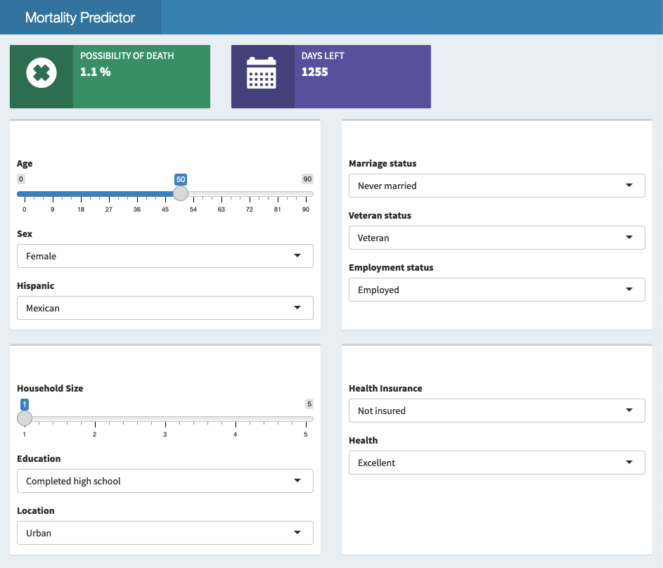

```{r setup, include=FALSE}
knitr::opts_chunk$set(echo = TRUE)

# Packages & Sources -------
source("R/functions.R")

# READ Data -------
nlms <- readRDS("data/clean/nlms_factored.rds")
deaths <- readRDS("data/clean/deaths_only.rds")

# READ Models ------
nlms_logistic <- readRDS("data/models/logistic_nlms.RDS")
imp <- readRDS("data/models/nlms_varImportPlot.rds")
deaths_rf <- readRDS("data/models/randomForest_deaths-only.RDS")
deaths_predicted <- readRDS("data/models/randomForest_deaths-predicted.rds")
```

## Introduction

Large national studies of mortality, especially cardiovascular mortality, by occupation, industry, income, education or other socioeconomic factors are rare.
From the studies that do exist, however, it is clear that strong relationships exist between socioeconomic factors and mortality$^1$.
These relationships may be influenced by and may account for differences in mortality by race, ethnic origin, or geographic factors.
To study these relationships in detail, large studies, inclusive of the ethnic, social and economic diversity of the U.S., are needed.

To combat this gap in data, the National Longitudinal Mortality Study (NLMS)$^2$ ran from 1973-2011 and was sponsored by the National Heart, Lung, and Blood Institute, the National Cancer Institute, the National Institute on Aging (all part of the National Institutes of Health), the National Center for Health Statistics part of the Center for Disease Control and Prevention, and the U.S.
Census Bureau for the purpose of studying the effects of differentials in demographic and socio-economic characteristics on mortality.

### Research Questions

**What demographic variables are significant predictors of an individual's death within the next six years?**

**If that individual does pass away, what variables are significant predictors of the length of days that person survives from the initial interview?**

## Data Source

The NLMS Public Use Microdata Sample (PUMS) is a specialized extract of the full NLMS that is designed to provide easy access to an extract of the main study while protecting the confidentiality of those who have responded to the original surveys on which the NLMS is based.
The PUMS format actually describes three files, divided according to whether the original CPS surveys were taken in the early 1980s, File 6a, early 1990s, File 6b, or early 2000s for File 6c.
All of these three files have a maximum follow-up duration of six years.

Standard demographic and socio-economic variables such as education, income, and employment, as well as information collected from death certificates including cause of death are available for analyses.

This analysis used the six year followup study beginning in 2000, since this data is most recent.

## Descriptive Statistics

### Dependent Variables

There are two dependent variables for this analysis.

One is a **death indicator variable**, indicating whether the study participant passed away within the six years of the study or not.

```{r stats-for-death-indicator, echo=FALSE}
#| label: tbl-frequency
#| tbl-cap: "Frequency Tables"
#| layout-ncol: 3

# sex table
knitr::kable((as.data.frame(
                  xtabs(~ sexF + inddeaF, 
                          data = nlms)
                          )), 
                          caption = "Sex")

# race table
knitr::kable((as.data.frame(
                  xtabs(~ raceF + inddeaF, 
                          data = nlms)
                          )), 
                          caption = "Race")

# health insurance type table
knitr::kable((as.data.frame(
                  xtabs(~ hitypeF + inddeaF, 
                          data = nlms)
                          )), 
                          caption = "Insurance")
```

The other dependent variable is **a numerical count of of days an individual *who does die within the six years of the study* survived after the initial interview** (which has been standardized across observations to April 1st, 2000).

```{r stats-for-follow, echo=FALSE}
sum_stats_hist(deaths$follow, 
               title = "Days Survived After Interview",
               x_axis = "Days",
               bins = 50)
```

The distribution of days after the interview that a person survived is uniform.
This presents serious challenges for modeling with this variable.
If a (relatively) even number of people died each day, the most a model can do is provide the median or mean of the data as the predicted value.

### Independent Variables

There are a large number of independent variables, all relating to the demographics of the individual, including:

-   age, sex, race, Hispanic origin,

-   marital status, employment status, homeownership status, citizenship

-   level of education, location (as 'urban' or 'rural'),

-   type of work (as 'blue collar' or 'white collar'),

-   work industry,

-   income (as a percent of the poverty level),

-   number of individuals in the household,

-   and type of health insurance (if any).

The only health-related variable in the data is a description of the individual's general health as 'excellent', 'very good', 'good', 'fair' and 'poor'.

## Analysis

To discover the independent demographic variables' relationship to each of the dependent variables, this analysis will construct two models:

-   a logistic regression model of the independent variables' relationship to the death indicator variable, using the full dataset

-   a regression model of the independent variables' relationship to the count of days survived variable, using a subset of the data including only those who did die during the study period

### Chance of Death Model

To examine the relationships between each individual independent variable and the death indicator indicator for significance, as well as to check conditions for regression, this analysis used the chi squared test of independence to compare categorical variables to the death indicator variable.
The `chisq.test()` function used automatically applies Yates' continuity correction to binary variables(applicable here).

With such a large dataset, this analysis also examined the association of the two variables by calculating the estimated effect size of the relationship using Cramer's Association test$^5$ and accompanying V statistic.

The variables meet all the conditions for these tests:

-   **Independence**: All variables are independent of each other.
    Each variable is a demographic quality of an observation, and each observation is an individual person.
    Since families have not been indicates for anonymity, we must assume all participants were unrelated to each other genetically.

-   **Sample Size**: Since the data set is nearly three-quarters of a million observations, all variables and their levels have frequencies well above 10 counts each.

To perform these tests, the analysis used custom functions.

The `independence_test` function is for comparing categorical variables to the death indicator i s printed here.
(Almost all variables in the dataset are categorical.)

```{r binary-to-death-indicator, echo=TRUE}

independence_test <- function(col) {
  
  # Create the contingency table
  frequency <- xtabs(~ col + inddeaF, 
                     data = nlms)
  
  # Perform chi-square test of independence
  print(chisq.test(frequency))
  
  # Calculate association with Cramer's V
  print(paste("Cramer's Association:", 
              lsr::cramersV(frequency)))
}

```

The `anova_to_death` function for testing the relationship between numerical variables, of which there are only two - `age` and `hhnum` (number of people in household), to the death indicator.

```{r numerical-to-death-indicator, echo=TRUE}

anova_to_death <- function(col, bins) {
  
  # fit ANOVA model
  results <- aov(formula = col ~ inddeaF,
                 data = nlms)
  print(summary(results))
  
  # check homogeneity of variance with Levene's test on residuals
  print(car::leveneTest(results))
  
  #check normal distribution with histogram of residuals
  hist(x = residuals(results), 
       col = "skyblue", 
       border = "black",
       breaks = bins)
}

```

These tests all returned p-values for the individual variable relationships that were *extremely* small, indicating significant statistical significance.
Because so many variables returned a highly significant p-value, this analysis also included Cramer's Association test to help evaluate getting better model fit by evaluating which variables were most highly *associated* with the data, as well as how significant it was.

The Cramer values for the relationships between every single independent variable and the death indicator were all **very** low, indicating that the association relationships is weak.
These tests demonstrate that although the variables' relationship is dependent and is statistically significant, they are only weakly associated.

#### Model Build

To avoid overfitting the model, this analysis includes only independent variables with Cramer association values greater than 0.1:

-   marital status

-   number of household individuals

-   veteran status

-   health status

-   employment status

-   type of health insurance

The death indicator variable is binary, prompting a logistic regression model for prediction, and a receiver operating characteristic curve (ROC) curve$^12$ for evaluation. An ROC plot is commonly used in binary classification tasks to evaluate the performance of a model in terms of its ability to discriminate between the positive and negative classes.

#### Model Evaluation

```{r nlms-roc-plot, echo=FALSE}
# ROC Curve
# Predict probabilities on the test set
nlms_predicted <- predict(nlms_logistic, newdata = nlms, type = "response")

# Create ROC curve
nlms_roc_curve <- pROC::roc(nlms$inddeaF, nlms_predicted)

# Plot ROC curve
plot(nlms_roc_curve, main = "ROC Curve for Chance of Death Model", col = "blue")

# Calculate AUC
nlms_auc <- pROC::auc(nlms_roc_curve)

# Print AUC
print(paste("Area under the curve (AUC):", round(nlms_auc, 3)))


```

An ideal ROC curve hugs the top-left corner of the plot, indicating a high true positive rate and a low false positive rate across all threshold values. This indicates excellent model performance.
The ROC curve for the logistic model shows that the model balances specificity and sensitivity ideally. The Area Under the Curve (AUC) value for this model is 0.863 with a maxmium value of 1.
Overall, this is a well-fit model.

#### Model Results

```{r nlms-variable-importance-plot, echo=FALSE}
ggplot(imp, aes(x = reorder(vars, `%IncMSE`), y = `%IncMSE`)) +
  geom_col(fill = "skyblue", color = "black") + 
  geom_text(aes(label = round(`%IncMSE`), y = `%IncMSE` + 5), size = 3, color = "black") + 
  labs(x = NULL, y = "Importance",
       title = "Variable Importance Plot") +  
  coord_flip() +  
  theme_bw() +  
  theme(panel.grid.major = element_blank(),  
        panel.grid.minor = element_blank(), 
        axis.text.y = element_text(size = 8))
```

Among the six independent variables, the most influential variable is the only variable related to health in the dataset - health status rated from 'excellent' to 'poor'.

Marital status and employment type (white collar or blue collar) are nearly identically influential.
Health insurance type, number of people in your household and veteran status are the least influential.

### Days Left Model

The second model is a predictor of how many days a person who *does die* in six years of the study survived after the interview before they passed away.

Recall that this variable has a uniform distribution of values.
The uniform distribution of the number of days a patient survived after their interview (the dependent variable) prevents serious challenges.

Since this dependent variable is numeric, this analysis would like to use linear regression, but to do so the data must satisfy the conditions:

-   **Sample Size**: Since the data set is nearly three-quarters of a million observations, all variables and their levels have frequencies well above 10 counts each.

-   **Normality**: To test for a normal distribution of residuals in categorical variables, each variable's linear model's residuals were plotted to a histogram and a quartile-quartile plot via the custom function `test_normality`.

```{r test-normality, echo=TRUE}

test_normality <- function(col) {
  
  # fit ANOVA model
  results <- aov(follow ~ col,
                 data=deaths) 
  
  # histogram of residuals
  hist(x = residuals(results))
  
  # qq plot of residuals
  qqnorm(y = residuals(results))
}

```

Due to large sample size, the NorKolmogorov-Smirnov Test$^{10}$ evaluated all numerical variables for normality.

**Because of the outcome variable's uniform distribution, none of the variables fit the normality condition.**

-   **Homogeneity of Variance**: Since none of the variables have normal distributions, the Brown-Forsythe test$^4$ will replace the Levene test$^8$ to check for homogeneity of variance because the median measure in the Brown-Forsythe test is more robust to outliers and non-normal distributions.

```{r test-variance, echo=TRUE}

test_homogeneity_variance <- function() {
  # plot the variance
  boxplot(follow ~ col,
               data=deaths)
  
  # check homogeneity of variance with Brown-Forsythe test
bf_result <- onewaytests::bf.test(follow ~ col, 
                                  data = deaths)

# Print significant p-values
bf_result$p.value[bf_result$p.value < 0.05]
}

```

**However, all the variables do have homogeneity of variance**

#### Model Build

Several more variables than the Chance of Death model had p-values lower than 0.05, signally that they are statistically significant, and are included in building the model.
Beyond the variables in the Chance of Death model, the Days Left model includes:

-   age

-   sex

-   Hispanic/Latinx background

-   urban or rural location

-   education level

Since the data does not meet the normality assumption, but does have homogeneity of variance, as well as the independent variables are a mix of numeric and categorical variables, and the dependent variable has a uniform distribution, this analysis used r using a non-parametric Random Forest Regression model$^3$$^6$.
Non-parametric models make fewer assumptions about the underlying distribution of the data, which can be beneficial when data does not meet the assumptions of traditional parametric models.

Random Forest is a versatile ensemble learning method$^2$ and brilliantly coded R package$^9$) that can handle both numeric and categorical predictors, and it does not assume any particular distribution of the dependent variable.
Additionally, Random Forest Regression is ideal for data with many independent variables, because random decision forests correct for decision trees' habit of overfitting to the training set$^7$.

#### Model Evaluation

```{r deaths-eval-stats, echo=FALSE}
deaths_noNA <- na.omit(deaths)

# Compute Mean Absolute Error (MAE)
mae <- mean(abs(deaths_noNA$follow - deaths_predicted))
mae_formatted <- sprintf("%.2f", mae)

# Compute Mean Squared Error (MSE)
mse <- mean((deaths_noNA$follow - deaths_predicted)^2)
mse_formatted <- sprintf("%.2f", mse)

# Compute R-squared (R2)
rss <- sum((deaths_predicted - mean(deaths_noNA$follow))^2)
tss <- sum((deaths_noNA$follow - mean(deaths_noNA$follow))^2)
r2 <- 1 - (rss / tss)
r2_formatted <- sprintf("%.2f", r2)

# Output the results in Quarto format
```

```{r echo=FALSE, results="asis"}
cat("Mean Absolute Error: ", mae_formatted, "\n")
cat("Mean Squared Error: ", mse_formatted, "\n")
cat("R-squared: ", r2_formatted, "\n")

```

These metrics indicate that the model provides a moderate level of predictive accuracy.
Considering the size of the dataset, with 25,000 observations, and the uniform distribution of the predictor variable, the model's performance is reasonably good.
However, there is still room for improvement, particularly in reducing the error metrics and increasing the explanatory power of the model.

```{r deaths-variable-importance-plot, echo=FALSE}

# Get importance values as a data frame
imp = as.data.frame(randomForest::importance(deaths_rf))
imp = cbind(vars=rownames(imp), imp)
imp = imp[order(imp$IncNodePurity),]
imp$vars = factor(imp$vars, levels=unique(imp$vars))

# plot variable importance
ggplot(imp, aes(x = reorder(vars, IncNodePurity), y = IncNodePurity)) +
  geom_col(fill = "skyblue", color = "black") + 
  labs(x = NULL, y = "Importance",
       title = "Variable Importance Plot") +  
  coord_flip() +  
  theme_bw() +  
  theme(panel.grid.major = element_blank(),  
        panel.grid.minor = element_blank(), 
        axis.text.y = element_text(size = 8),
        axis.text.x = element_blank())
```

Age is the most important variable in predicting how many days the individual will survive after the interview.
Quality of health, number of individuals in the household, and level of education are the next most influential.

This makes sense, since those with poor health will most likely live fewer days than those who interviewed with excellent health.
The Chance of Death model showed number of people in the household has a large negative effect on a person's chance of death.
Being lonely will kill you.

## Model Application

The [Mortality Predictor](https://annejscott.shinyapps.io/mortality-predictor/) shiny$^{11}$ application uses user input to predict the user's chance of death in the next six years with the Chance of Death model and also to predict that if the user does die, how many days they have left with the Days Left model.




## Conclusion

This paper delved into the intricate relationship between demographic / socioeconomic factors and mortality outcomes in the United States.
The National Longitudinal Mortality Study (NLMS) dataset spanning from 1973 to 2011, included seventeen predictors of mortality and survival duration following the initial interview.

Despite encountering challenges such as non-normal residuals distributions and a dependent variable with a uniform distribution, the Chance of Death and Days After models fit with moderate success.
While these models provided valuable insights into mortality risk and survival duration, it's important to acknowledge the limitations posed by the peculiarities of the data.
The non-normal residuals distributions and the uniform distribution of the dependent variable necessitate cautious interpretation of the results.
Additionally, the complexities of the data underscore the need for further research to refine mortality dynamics and to develop more robust predictive models.

Further analysis can include training machine learning models on two unused datsets in the NLMS PUMS six year dataset that begins in 1990, and test them on a subset of the eleven year dataset (also begins in 1990), filtered to only include the deaths in the first six years of the eleven year study.

### References

1.  Barakat, C., & Konstantinidis, T.
    (2023). A Review of the Relationship between Socioeconomic Status Change and Health.
    *International Journal of Environmental Research and Public Health, 20*(13), 6249.
    <https://doi.org/10.3390/ijerph20136249>
    
2.  National Longitudinal Mortality Study (NLMS). (1973–2011). Open BioLINCC Study. Accession Number: HLB01561321a. Retrieved from https://www.census.gov/nlms

3.  Breiman, L. (2001). Random Forests. *Machine Learning, 45*(1), 5–32.
    <https://doi.org/10.1023/A:1010933404324>

4.  Brown, M. B., & Forsythe, A. B.
    (1974).
    Robust Tests for the Equality of Variances.
    *Journal of the American Statistical Association, 69*(346), 364–367.
    <https://doi.org/10.1080/01621459.1974.10482955>

5.  Cramér, H.
    (1946).
    *Mathematical Methods of Statistics* (Chapter 21. The two-dimensional case).
    Princeton University Press.

6.  Ho, T. K.
    (1995).
    Random Decision Forests.
    In *Proceedings of the 3rd International Conference on Document Analysis and Recognition* (pp. 278–282).
    Montreal, QC.
    <https://www.iapr.org/proceedings/Docs/Montreal/Conf/6.PDF>

7.  Hastie, T., Tibshirani, R., & Friedman, J.
    (2008).
    *The Elements of Statistical Learning* (2nd ed.).
    Springer.
    ISBN: 0-387-95284-5

8.  Levene, H.
    (1960).
    Robust Tests for Equality of Variances.
    In I. Olkin & H.
    Hotelling (Eds.), *Contributions to Probability and Statistics: Essays in Honor of Harold Hotelling* (pp. 278–292).
    Stanford University Press.

9.  Liaw, A., & Wiener, M.
    (2002).
    Classification and Regression by randomForest.
    *R News, 2*(3), 18–22.
    Retrieved from <https://CRAN.R-project.org/doc/Rnews/>

10.  Smirnov, N.
    (1948).
    Table for Estimating the Goodness of Fit of Empirical Distributions.
    *Annals of Mathematical Statistics, 19*(2), 279–281.
    <https://doi.org/10.1214/aoms/1177730256>

11. Chang W, Cheng J, Allaire J, Sievert C, Schloerke B, Xie Y, Allen J, McPherson J, Dipert A, Borges B (2024).
    *shiny: Web Application Framework for R*.
    R package version 1.8.1.9000,
    <https://github.com/rstudio/shiny,> <https://shiny.posit.co/>.
    
12. Junge, M. R.; Dettori, J. R. (May 3, 2024). *ROC Solid: Receiver Operator Characteristic (ROC) Curves as a Foundation for Better Diagnostic Tests*. Global Spine Journal. 8 (4): 424–429. doi:10.1177/2192568218778294. PMC 6022965. PMID 29977728.
